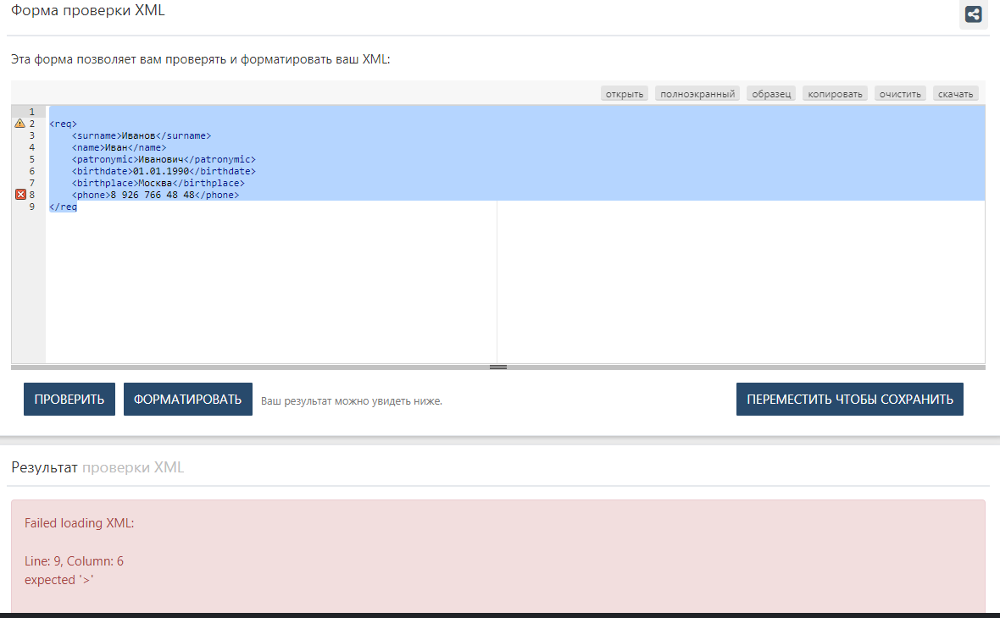
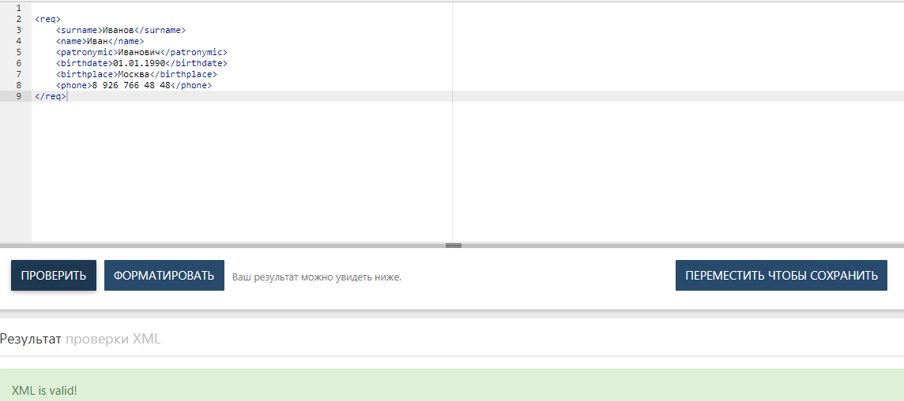
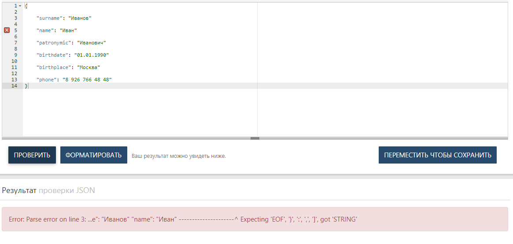
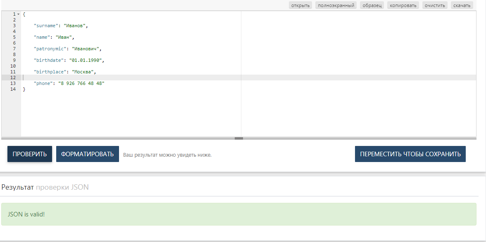

### Урок 5. JSON и XML
# Задача №1: проверить XML на Well formed:

```
<req>

    <surname>Иванов</surname>

    <name>Иван</name>

    <patronymic>Иванович</patronymic>

    <birthdate>01.01.1990</birthdate>

    <birthplace>Москва</birthplace>

    <phone>8 926 766 48 48</phone>
</req
```

# Задача №2: проверить JSON на Well formed:
```
{

    "surname": "Иванов"

    "name": "Иван"

    "patronymic": "Иванович"

    "birthdate": "01.01.1990"

    "birthplace": "Москва"

    "phone": "8 926 766 48 48"
}
```
Приложите правильный на ваш взгляд вариант.

### Решение

# №1




# №2



