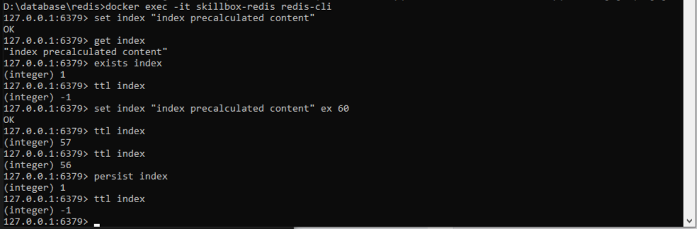
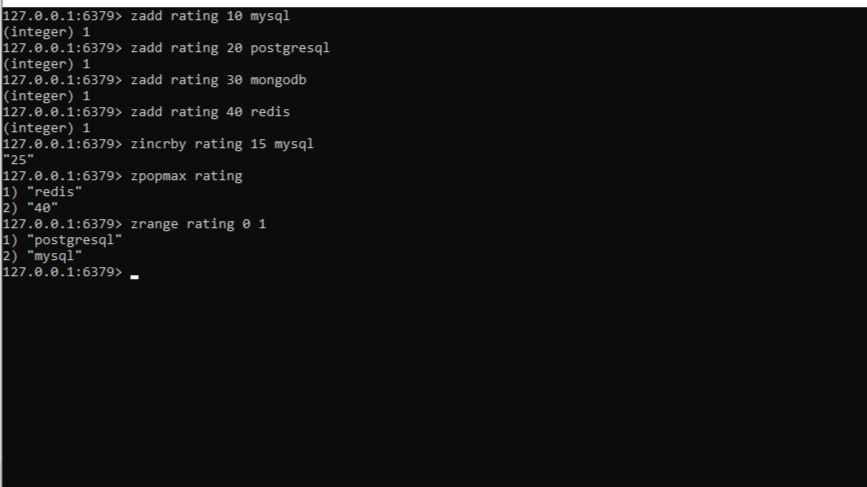
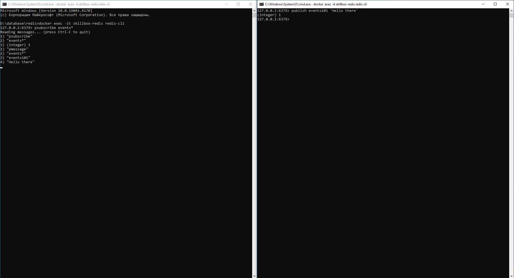
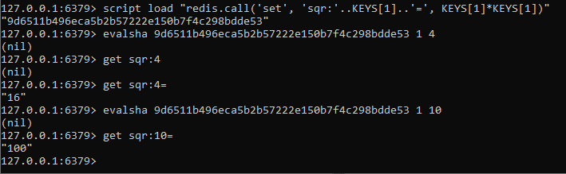

## Задание 1

> Цель практической работы:
> Научиться выполнять простые запросы в Redis.

> Что нужно сделать
> Напишите последовательность команд для Redis:
> Создайте ключ index со значением “index precalculated content”.
> Проверьте, есть ли ключ index в БД.
> Узнайте, сколько ещё времени будет существовать ключ index.
> Отмените запланированное удаление ключа index.

> > Что оценивается
> > Верная последовательность команд.

```
SET index "index precalculated content"
EXISTS index
TTL index
PERSIST index
```



## Задание 2

> Цель практической работы:
> Научиться работать со структурами данных в Redis.

> Что нужно сделать
> Напишите последовательность команд для Redis:
> Создайте в Redis структуру данных с ключом ratings для хранения следующих значений рейтингов технологий: mysql — 10, postgresql — 20, mongodb — 30, redis — 40.
> По этому же ключу увеличьте значение рейтинга mysql на 15.
> Удалите из структуры элемент с максимальным значением.
> Выведите место в рейтинге для mysql.

> >Что оценивается
> >Верная последовательность команд.

```
ZADD ratings 10 "mysql" 20 "postgresql" 30 "mongodb" 40 "redis"
ZINCRBY ratings 15 "mysql"
ZPOPMAX ratings 1
ZREVRANK ratings "mysql"
```



## Задание 3

> Цель практической работы:
> Научиться работать с механизмом Pub/Sub в Redis.

> Что нужно сделать
> Напишите две команды для СУБД Redis:
> Подпишитесь на все события, опубликованные на каналах, начинающихся с events.
> Опубликуйте сообщение на канале events101 с текстом “Hello there”.

> > Что оценивается
> > Верная последовательность команд.

```
bash
SUBSCRIBE events*
bash
PUBLISH events101 "hello there"
```



## Задание 4

> Цель практической работы:
> Научиться работать с хранимыми функциями в Redis.

> Что нужно сделать
> Сохраните в Redis функцию, которая принимает ключ и значение и сохраняет под указанным ключом квадратный корень от значения.

> > Что оценивается
> > Верный запрос.
```
local key = KEYS[1]
local value = tonumber(ARGV[1])

if not value then
    return redis.error_reply("Invalid value")
end

local square_root = math.sqrt(value)

return redis.call("SET", key, square_root)"

SCRIPT LOAD "$(cat sqrt.lua)"

EVALSHA <идентификатор скрипта> 1 <ключ> <значение>
```
